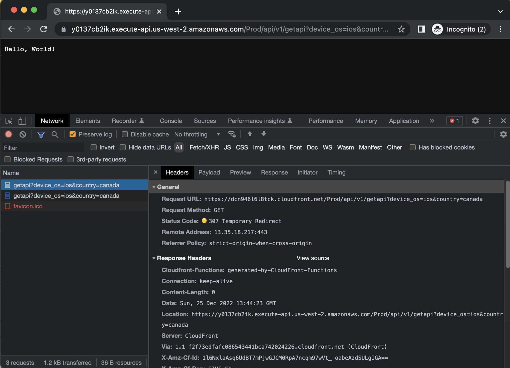

# CloudFront Function for URL Redirection
URL redirect to the new domain of an API endpoint

CloudFront Functions event type: viewer request

This function redirects an API request to new domain of the API endpoint in order to migrate the API endpoint domain without many changes to the original deployment. For instance, if an API endpoint is deployed to `www.example.com` on the path `/api/v1/` alongside other workloads and it is used by different applications and third-parties, it will be difficult to migration the API endpoint domain to a new domain (`api.example.com`, etc.) safely. It will be easier to implement the redirection to the CloudFront distribution.

This function checks the path of the request and redirects the URL to a new domain while preservces all headers and parameters for GET, HEAD, POST, and PUT HTTP methods. You can manipulate headers and/or parameters if needed.

## Code
http-redirection.js

## Testing the function

